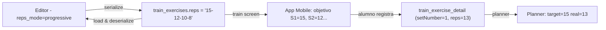

# Repeticiones Progresivas en Rutinas

## Contexto y Problema

Actualmente, cada ejercicio en una rutina tiene un único valor de `reps` (entero) que aplica a **todas sus series** de manera uniforme. Se requiere soportar **repeticiones progresivas**: cada serie puede tener su propio número de reps (ej. 4 series de 15-12-10-8).

Existen, por ende, **dos modos** para ejercicios con `measure_type = 'Reps'`:
1. **Reps uniformes** (comportamiento actual): todas las series tienen el mismo valor → `reps = 12`
2. **Reps progresivas** *(nuevo)*: cada serie tiene un valor distinto → `reps = "15-12-10-8"`

---

## Diseño de Modelado

### Estrategia elegida: campo `reps` como string serializado

La forma más directa y compatible con el esquema existente es **cambiar el tipo de `reps` en `train_exercises` de `INTEGER` a `VARCHAR`** y usar una convención de formato:

| Formato del valor | Interpretación |
|---|---|
| `"12"` | Reps uniformes: 12 por cada serie |
| `"15-12-10-8"` | Reps progresivas: serie 1→15, serie 2→12, serie 3→10, serie 4→8 |

**¿Por qué este enfoque en lugar de una tabla separada?**
- Mínimo impacto en el esquema existente (una sola columna cambia de tipo)
- No rompe la lógica existente de `train_exercise_detail` (que ya tiene una row por set + `reps` propio al registrar progreso real)
- Fácil de parsear/serializar en frontend y mobile
- La "meta-prescripción" del trainer vive en `train_exercises.reps`, y el progreso real del alumno sigue en `train_exercise_detail.reps` (por set, ya existente)

> **NOTA:** `train_exercises.reps` es la *prescripción* (objetivo del trainer). `train_exercise_detail.reps` es el *progreso real* (lo que el alumno ejecutó). Esta distinción ya existe y no cambia.

---

## Impacto en el seguimiento de progreso (`train_exercise_detail`)

La tabla `train_exercise_detail` ya tiene la estructura correcta para manejar progreso por serie:

```
(trainExerciseId, week, setNumber) → { kg, reps, status }
```

Con repeticiones progresivas, la **prescripción objetivo** del set se deriva de parsear `train_exercises.reps`:
- Set 1 → objetivo 15 reps
- Set 2 → objetivo 12 reps
- Set 3 → objetivo 10 reps
- Set 4 → objetivo 8 reps

La app mobile/planner puede mostrar el objetivo por set al momento de entrenar. **No se requiere ningún cambio en `train_exercise_detail`** — ya trackea reps reales por set.

---

## Cambios Propuestos

### 1 · Base de Datos — Migración `018_progressive_reps.sql`

```sql
-- Cambiar el tipo de reps de INTEGER a VARCHAR en train_exercises
ALTER TABLE public.train_exercises 
  ALTER COLUMN reps TYPE VARCHAR(50) USING reps::VARCHAR;

-- También en train_exercise_detail, reps ya es INTEGER (el real del alumno) → NO cambia
```

> ⚠️ **Nota:** La columna `reps` de `train_exercise_detail` **permanece como INTEGER** porque registra las reps reales ejecutadas en cada set individualmente.

#### [NEW] `supabase/migrations/018_progressive_reps.sql`

---

### 2 · UI — `RoutineEditor.jsx`

#### Cambios en `buildRoutineExercise` (helper)

```js
const buildRoutineExercise = (exercise) => ({
  _id: generateId(),
  exerciseId: exercise.id,
  name: exercise.name,
  muscle_id: exercise.muscle_id,
  measure_type: exercise.measure_type || "Reps",
  sets: 0,
  reps: "0",
  reps_mode: "uniform",  // ← NUEVO: "uniform" | "progressive"
  // reps_per_set no se guarda en el objeto del editor; se deriva al serializar
});
```

El campo `reps_mode` es **solo UI state** — no se persiste directamente en la DB. Al guardar, se serializa `reps` como string apropiado.

#### Cambios en `ExerciseCard` — Zona de inputs de medición

Cuando `measureType === 'Reps'`, se muestra un **toggle** entre los dos modos:

```
┌─────────────────────────────────────┐
│  SETS    MODO                        │
│  [4]     [Uniforme | Progresivo]     │
│                                     │
│  REPS (modo uniforme):              │
│  [12]                               │
│                                     │
│  REPS (modo progresivo):            │
│  S1:[15]  S2:[12]  S3:[10]  S4:[8] │
└─────────────────────────────────────┘
```

**Comportamiento del modo progresivo:**
- Al activar el modo progresivo, se generan `N` inputs de reps (uno por cada set definido)
- Si `sets` cambia mientras se está en modo progresivo, los inputs se ajustan automáticamente (agrega/quita inputs al final, preservando los existentes)
- El valor `reps` del ejercicio se serializa como `"15-12-10-8"` al momento de guardar

**Lógica de serialización (en `handleSave`):**

```js
// Al serializar train_exercises:
const serializeReps = (ex) => {
  if (ex.reps_mode === 'progressive' && ex.reps_per_set?.length > 0) {
    return ex.reps_per_set.join('-');  // "15-12-10-8"
  }
  return String(ex.reps ?? 0);  // "12"
};
```

**Lógica de deserialización (al cargar rutina existente):**

```js
// Al parsear ejercicios de la DB para el editor:
const deserializeReps = (repsStr) => {
  if (typeof repsStr === 'string' && repsStr.includes('-')) {
    const parts = repsStr.split('-').map(Number);
    return { reps: parts[0], reps_per_set: parts, reps_mode: 'progressive' };
  }
  return { reps: Number(repsStr) || 0, reps_per_set: [], reps_mode: 'uniform' };
};
```

Este parseo debe hacerse en `RoutinesPage.jsx → handleEdit()` donde se transforma la rutina antes de pasarla al editor.

#### [MODIFY] `RoutineEditor.jsx`
- `buildRoutineExercise`: agregar `reps_mode: 'uniform'`, `reps_per_set: []`
- `ExerciseCard`: agregar toggle UI + inputs progresivos por set
- `handleSave`: usar `serializeReps()` al construir `train_exercises`

---

### 3 · `RoutinesPage.jsx` — Deserialización al cargar

En `handleEdit()`, al mapear los `train_exercises` de la DB a la estructura del editor, usar `deserializeReps()` para inferir `reps_mode` y `reps_per_set`:

```js
const parsedExercise = {
  ...baseExercise,
  ...deserializeReps(ex.reps),
};
```

#### [MODIFY] `RoutinesPage.jsx`

---

### 4 · `routinesService.js` — Sin cambios de firma

El servicio ya recibe `train_exercises` como array y hace upsert. Solo se asegura de pasar `reps` como string (que es lo que la nueva columna acepta). No requiere cambios adicionales.

---

### 5 · Contexto del proyecto — Actualización de SKILL.md

Actualizar `fitness-context/.agents/skills/shared-supabase/SKILL.md` para documentar:
- Cambio de tipo de `train_exercises.reps` a `VARCHAR(50)`
- Convención de formato `"N"` (uniforme) vs `"N1-N2-N3-N4"` (progresivo)

#### [MODIFY] `shared-supabase/SKILL.md`

---

## Diseño Visual del Toggle en `ExerciseCard`

```
SETS   [4]       ○ Uniforme  ● Progresivo
                 ────────────────────────
REPS POR SERIE:
  S1 [15]  S2 [12]  S3 [10]  S4 [8]
```

- El toggle es un `ToggleButtonGroup` de MUI compacto (estilo pill)
- Los inputs de series se renderizan en una grilla horizontal compacta
- Cada input tiene ancho ~46px, label "S1", "S2", etc.
- Si `sets` es 0 o vacío, el modo progresivo muestra un mensaje guía
- Transición suave entre modos

---

## Flujo Completo de Datos



---

## Preguntas Abiertas

> [!IMPORTANT]
> **¿Debe el Planner semanal mostrar el objetivo por set de las reps progresivas?**  
> El `RoutinePlannerPage` actualmente muestra `sets × reps` como resumen. Con reps progresivas, el objetivo es por set. ¿Querés que el planner muestre `15-12-10-8` como indicación o solo el primer valor como referencia? (Este cambio quedaría fuera del scope de este plan y se puede hacer en una iteración posterior.)

> [!IMPORTANT]
> **¿La app mobile (fitness-app) necesita actualizarse en paralelo?**  
> Para que el alumno vea el objetivo correcto por set durante el entrenamiento, la app mobile debe parsear el nuevo formato de `reps`. ¿Está en scope o es una tarea separada?

---

## Plan de Verificación

1. **DB:** Correr migración en Supabase y verificar que columna `reps` acepta `VARCHAR`
2. **Backward compat:** Rutinas existentes (con reps como número entero) se cargan correctamente y se muestran como "Uniforme"
3. **Crear rutina:** Agregar ejercicio en modo progresivo con 4 series y reps 15-12-10-8 → guardar → verificar en DB que `reps = '15-12-10-8'`
4. **Editar rutina:** Abrir rutina existente con reps progresivas → verificar que se restaura el modo progresivo con los inputs correctos
5. **Cambio de sets:** En modo progresivo, cambiar sets de 4 a 3 → verificar que desaparece el último input y el valor serializado es `"15-12-10"`
